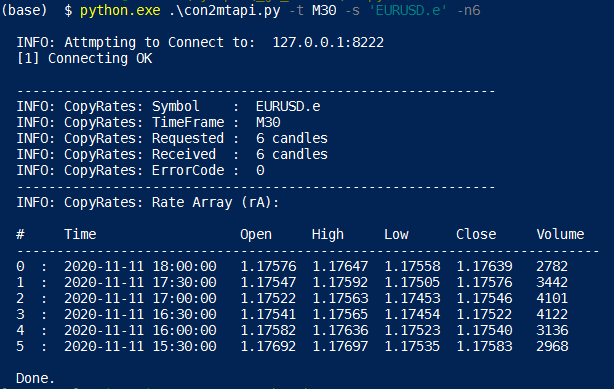
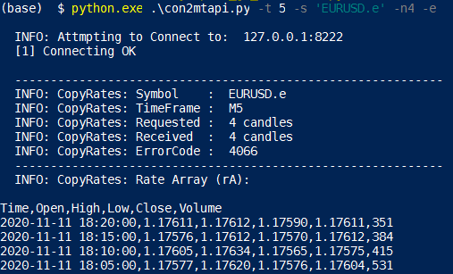
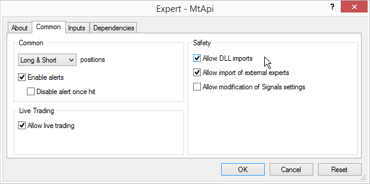

### mt4pycon - The MT4 Python Connector

[![pypi supported versions][1]][2]
[![PyPI version][3]][4]
[![Last Update][5]][6]

[1]: https://img.shields.io/pypi/pyversions/mt4pycon.svg
[2]: https://pypi.python.org/pypi/mt4pycon "Supported Python versions"
[3]: https://badge.fury.io/py/mt4pycon.svg 
[4]: https://badge.fury.io/py/mt4pycon "PIP Package Version"
[5]: https://img.shields.io/badge/Release_Date-2020--11--11-green.svg
[6]: https://GitHub.com/eabase/mt4pycon/graphs/commit-activity "Last Release Date"


The **`mt4pycon`** repo is a collection of Python3 code used to interface with MT4 and MT5 
terminals via 3rd party API's. As of today there is only one script available, but will 
soon contain several other examples for simple indicators, data scrapers/analyzers to 
AI/ML automated trading bots.


---

**`con2mtapi`**

This is a simple *Python3* CLI client that is using the MT4 bridge API 
([mtapi](https://github.com/vdemydiuk/mtapi/)) to connect to a MT4 Terminal which 
is running the `MtApi.ex4` *Expert Advisor (EA)*. It communicates with the EA using either 
a TCP/IP `host:port` pair or a *pipe* port, to get some historical OHLCV formatted candle data 
for a specified symbol and timeframe. This particular script is using the MQL built-in 
`CopyRates` and `iBars()` functions for receiving the candle data.


Example Output:

<sub>Using symbolic TF and normal tabulated output.</sub>  


<sub>Using numerical TF and CSV output.</sub>  


---

**Q:** *What is **`mtapi`** and what does it do?*

The *MetaTrader API* is a Windows library bridging your MT4/5 *Terminal* and .NET. 
It consists of a number of DLL files created in .NET that need to be installed separately, 
which in turn depends on wheater you are using MT4 or MT5 as your terminal server. 
(Installation instructions and links to the Windows installers can be found below.)


**Q:** *What does **`con2mtapi.py`** do?*

The primary use is for demonstrating how to use Python3 to connect to an MT4 or MT5 Terminal 
instance using the *mtapi* library. It will retrienve and display historical OHLCV formatted 
candle data, given a specific *symbol, timeframe* and the number of requsted candles. 

Furthermore, you can easily expand the example to get and make use all of the native MQL4 
commands. In which case you can do anything already available in the MQL4 and much more, 
since you are no longer limited by MT4's lack of API support. Although the perfomance 
offered is far from excellent, it's more than good enough to excute and monitor scalping 
trades on low timeframes.


**Q:** *What does it **not** do?*

- Does not send your python code and algorithms to *MetaQuotes* servers.
- Does not allow for *HFT* trading, althogh 1M and 5M scalping is possible.
- Does not provide any reliability for trading safely.
- Does not (yet) have a listener for live feeds.


**Q:** *What other limitations does it have?*

<sub>:red_circle:</sub> The number of candles available for download, is completely determined by the 
settings of your terminal (*`MaxBars`*) **and** how much symbol history is avalable 
from your broker. If you can only see a few months (or <4000 `M5` candles) of data, 
you should consider changing your broker. 


**Q:** *Why is this needed?*

It probably isn't if you are already happy to use MT5, **BUT** most brokers still get 
talked into using the high-maintenace MT4 terminal *client, manager* and *server* 
infrastructure. Afterall, it works and is well proven although outdated by decades.

Another very good reason is that the MT5 Python API provided by *MetaQutes* (MQ) is 
closed-source and are also sending your Python code to their own MQ servers, thus 
rendering all your intellectual property wide open and available for unknown 3rd 
parties. Obviously not a good idea in world where algorithms are money.


**Q:** *Will I continue to support this tool?*

Maybe, if it is broken, but I will not spend much more time for new features. 
There are plenty of alternative and far better platforms (such as 
*[xStation](https://xstation5.xtb.com/)* and *[cTrader](https://ctrader.com/)*) 
that are doing quite a bit of open-source development and trading integration in a far 
more modern context. However, if you would like me to add something, just send me a PR, 
or at the very least a detailed enhancement issue of what you would like to implement. 
As always, any small crypto donation is an inspitring incentive to make things happen faster.

---

### Dependencies

Python packages: 

* [pythonnet](https://github.com/pythonnet/pythonnet) - `Python.NET` for the .NET *Common Language Runtime* (CLR)

and what you already have: 
* [MT4](https://github.com/rosasurfer/mt4-mql) - Latest (unbranded) MT4 and MetaEditor4 downloads
* [MtApi](https://github.com/vdemydiuk/mtapi/) - The MT4/5 Terminal to .NET bridge library


### Installation  

Using the scripts in this repo code, require 3 things:  
1. Installing the MtApi DLL Libraries
2. Copying some DLL's to the script directory
3. Installing the MtApi Expert Advisor
4. Installing `con2mtapi.py`

#### 1. Installing the MtApi DLL Libraries

The *MtApi* DLL's are installed with a normal (WIX-based) Windows installer.
Make sure to use the correct installer for your OS, and for the MT4/5 Terminal 
you want to connect with. Always, check the 
[releases](https://github.com/vdemydiuk/mtapi/releases) in the original MtApi 
repo for the latest versions. Pay attention to the MT4 vs MT5 versions, as 
the installers are different.

* For `MT4 (32-bit x86)` use: [`MtApi_Setup.exe`](https://github.com/vdemydiuk/mtapi/releases/download/MT4-v1.0.42/MtApi_Setup.exe) [1.0.42]
* For `MT5 (32-bit x86)` use: [`MtApi5_Setup_x86.exe`](https://github.com/vdemydiuk/mtapi/releases/download/MT5-v1.0.24/MtApi5_Setup_x86.exe) [1.0.24]
* For `MT5 (64-bit x64)` use: [`MtApi5_Setup_x64.exe`](https://github.com/vdemydiuk/mtapi/releases/download/MT5-v1.0.24/MtApi5_Setup_x64.exe) [1.0.24]


The installation locations for the installed DLL files are:
```powershell
MtApi.dll            # MQL API                       # C:\Program Files (x86)\MtApi\MtApi.dll
Newtonsoft.Json.dll  # JSON handler                  # C:\Program Files (x86)\MtApi\Newtonsoft.Json.dll
MTConnector.dll      # MT4 specific connector        # C:\windows\SysWOW64\MTConnector.dll
MT5Connector.dll     # MT5-x86 specific connector    # C:\windows\SysWOW64\MT5Connector.dll
MT5Connector.dll     # MT5-x64 specific connector    # C:\windows\System32\MT5Connector.dll
MTApiService.dll     # API bridge                    # C:\windows\Microsoft.NET\assembly\GAC_MSIL\MTApiService\...\MTApiService.dll
```

*For example:* 

For an MT4 installation the following default locations are used:

```bash
# tree 'C:\Program Files (x86)\MtApi\'
C:\Program Files (x86)\MtApi\
├── Experts
│   └── MtApi.ex4
├── MtApi.dll
└── Newtonsoft.Json.dll

# tree 'C:\windows\Microsoft.NET\assembly\GAC_MSIL\MTApiService'
C:\windows\Microsoft.NET\assembly\GAC_MSIL\MTApiService
└── v4.0_1.0.33.0__fe39c8c11cabcd1e
    └── MTApiService.dll

# find /cygdrive/c/Windows/{System32,SysWOW64}/ -iname "MT*Connector.dll"
C:\windows\SysWOW64\MTConnector.dll
```

#### 2. Copying some DLL's to the script directory

Unless the DLL locations (above) have also been added to your Windows 
System PATH variable, your scripts will not know where to find them. 
So you need to copy the following DLL's to the same location as your script.

```
MtApi.dll
Newtonsoft.Json.dll
```

#### 3. Installing the MtApi Expert Advisor

1. Open your MT4/5 Terminal
2. Find the correct *Data Directory* of your MT4/5 Terminal
   [`File >> Open Data Folder`] 
3. Locate the *path* to the `../MQL4/Experts/` folder in (2).
4. Copy the `MtApi.ex4` file from the installation directory, to the folder above (3).
5. Open the MT (file) *Navigator* window with `CTRL-N`.
6. Drag the EA in (4) to any chart in your MT4/5 Terminal
7. Make sure your EA Settings are as follows:

<details>
<summary><sub> Click Here!</sub></summary>



</details>


#### 4. Installing *con2mtapi*

* For pip installation:

```bash
pip install mt4pycon
```

<details>
<summary><b>Click Here</b> for other options</summary>

  
* For single file installation:

```bash
cd /usr/bin/
wget -Lk https://github.com/eabase/mt4pycon/raw/master/con2mtapi.py
chmod 755 con2mtapi.py
```

* For developer installation:

```bash
# git clone --single-branch --depth=1 https://github.com/eabase/mt4pycon.git
git clone https://github.com/eabase/mt4pycon.git
cd mt4pycon
pip install mt4pycon --user
```

</details>


:sparkles: **Done!**

---

### Modifying the EA and Compilation

If you want to compile your own MtApi libraries, please check the original 
*mtapi* github repo for detailed compilation instructions.

In summary, for modifying the EA, you would need to:  
(a) Copy the `MtApi.mq4` file into the `../MQL4/Experts/` folder  
(b) copy the following MQL Library files into the `../MQL4/Include/` folder:  

```bash
hash.mqh
json.mqh
mql4-auth.mqh
```

(c) Recompile `MtAPi.mq4` in *MetaEditor4*.


---

### How to Run

1. Make sure you have installed the correct DLL's (as described above)
2. Make sure you have copied the 2 DLL's to your script location (or that they are in the Windows System PATH.)
3. Make sure you are allowing these (default) connections through you Windows Firewall:  
   * For MT4: use port **`8222`**
   * For MT5: use port **`8228`**

<details>
<summary><i>Click For Details</i></summary>  

In Windows powershell, you can check these FW ports with: 
```powershell
# Check on what interfaces the FW is enabled
Get-NetFirewallProfile -Profile Domain, Public, Private | Select-Object Name, Enabled

# Check for specific port rules
Get-NetFirewallPortFilter | ?{$_.LocalPort -eq 8222} | Get-NetFirewallRule

# Set FW rule for MT4API (for localhost?)
$desc = "This port is used by the MtApi .NET MT4 API connector."
New-NetFirewallRule -Name mtapi -DisplayName 'MT4API' -Description $desc -Enabled True -Direction Inbound -Protocol TCP -Action Allow -LocalPort 8222
```

</details>


4. Copy the EA into the `../MQL4/Experts/` data folder of your MT4 Terminal, normally located at:

```xml
C:\Users\<username>\AppData\Roaming\MetaQuotes\Terminal\<unique-hash>\MQL4\Experts\
```

5. Check the available `con2mtapi` command line options with:

<table><tbody><tr></tr><tr><td><details><summary><sub><b>Click To See</b></sub>

```bash
# python.exe .\con2mtapi.py -h
```
</summary>

```bash

  Usage:  ./con2mtapi.py

  This connects to an MT4 EA via a TCP port (or pipe) to receive OHLCV data.

  --------------------------------------------------------------------------------
  Command Line Options:
   -d              : Enable extra debug info
   -n <n>          : Show <n> number of candles back
   -p              : Use a "Named Pipe" connection (instead of a TCP IP host:port)
   -l              : Show candle data as a list (one line per OHLC item)
   -s <symbol>     : Set symbol name to <symbol>   ["EURUSD"]
   -t <timeframe>  : Set timeframe to <timeframe>  [M1,M5,M15*,M30,H1,H4,D1,W1,MN1]**
   -h, --help      : Show THIS help list
   -v, --version   : Show THIS program version
  --------------------------------------------------------------------------------
   *  = a default setting
  **  = The standard MT4 TF's are:
        [M1,M5,M15,M30,H1,H4,D1,W1,MN1]
        [1,5,15,30,60,240,1440,10080,43200]

        The non-standard TF's are: (not yet available)
        [M2,M3,M4,M6,M10,M12,M20,H2,H3,H6,H8,H12]
        [2,3,4,6,10,12,20,120,180,360,480,720]
  --------------------------------------------------------------------------------

  Example for Windows:
  python.exe .\con2mtapi.py -n4 -s "CADCHF.x" -t H4 -p -d

  Please file any bug reports at:
  https://github.com/eabase/mt4pycon/

  For support of the MT4/5 API, see:
  https://github.com/vdemydiuk/mtapi/

  Version:  1.0.2
  License:  MIT (2020)

```
</details></td></tr></tbody>
</table>


---

#### References:

<sub>

* [mtapi](https://github.com/vdemydiuk/mtapi/)  
</sub>


#### Recommeded Similar Tools:

`TBA`


#### Known Bugs and Warnings

* When running the script for the *first* time on a certain symbol and timeframe, the 
candle data will not be available in the MT4 terminal buffer, so the script will fail. 
Just run it again and MT4 will most likely have already downloaded the new data. I have 
not been able to resolve this issue. 


#### ToDo / Help Needed

See issues marked [ToDo](https://github.com/eabase/mt4pycon/issues?q=is%3Aopen+is%3Aissue+label%3AToDo).

#### Contribution

Feel free to post issues and PR's related to this tool.  
Feel free to fork, break, fix and contribute. Enjoy!


#### Donation

Almost everything I do is Free and Open Source Software (FOSS). 
This means that I do not receive any income on any of my projects. 
So if you find any of my projects or code, cool & useful, please 
consider making a small donation to any of my crypto accounts.

<details><summary>Adresses</summary>

| Symbol | Name | Address |
|:--------:|:--------:|:--------|
| BTC | Bitcoin  | `bc1qkcyxnerc2sa8xn8d30wkgfqy64jhcxxzf0xv05` |
| ZEC | Zcash    | `t1aDszWfkHcSR5yjYrpjYLxj44Lfw7g9GDn` |
| XMR | Monero   | `43ACVrQMQ23bh99S7ohJ4cbDA7mVXwUcYRNjyVkr4t3bgqikfpvQu9i4aBeu7vmzCKJek3pkidEFMYEZ6fJpb6Y6HgPAC5m` |
| ETH | Ethereum | `0x53266f143193e08B91bF943a694f8F9D9435163B` |
| LTC | Litecoin | `LW7Eu5omvBPRA1sXrKDtemVBrMYzFdwRAF` |

</details>


#### Additional Badges

<!--
[![build status][11]][12] [![Codacy Badge][13]][14] [![codecov][15]][16]
-->


#### License

[![GitHub license][21]][22]  
A license to :sparkling_heart:!

<sub>I use an `MIT` license because I support [mtapi](https://github.com/vdemydiuk/mtapi/).</sub>

[11]: https://ci.appveyor.com/api/projects/status/github/mt4pycon/mt4pycon?branch=master&svg=true
[12]: https://ci.appveyor.com/project/mt4pycon/mt4pycon
[13]: https://api.codacy.com/project/badge/Grade/176ceaabe43d4113b535f2fbd0487a9e
[14]: https://www.codacy.com/app/eabase/mt4pycon?utm_source=github.com&amp;utm_medium=referral&amp;utm_content=eabase/mt4pycon&amp;utm_campaign=Badge_Grade
[15]: https://codecov.io/gh/mt4pycon/mt4pycon/branch/master/graph/badge.svg
[16]: https://codecov.io/gh/mt4pycon/mt4pycon

[21]: https://img.shields.io/github/license/eabase/mt4pycon.svg
[22]: https://github.com/eabase/mt4pycon/blob/master/LICENSE.txt
